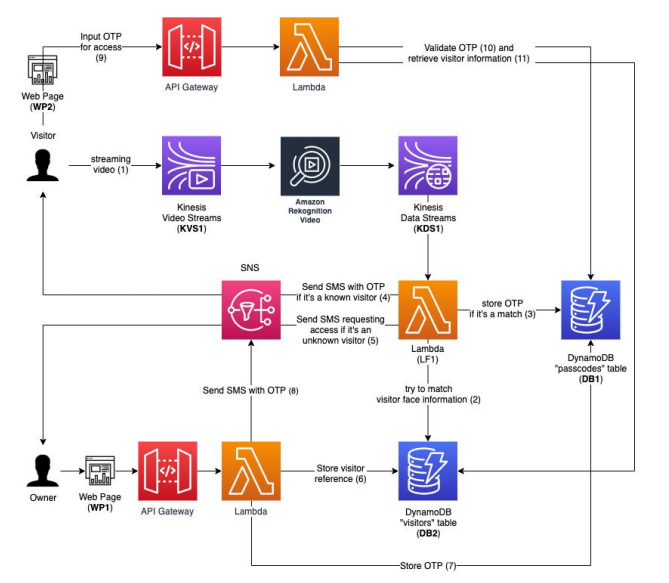

# Smart-Door-Authentication-System

A Smart Door authentication system that uses Kinesis Video Streams and Amazon Rekognition to build a distributed system that authenticates people and provides them with access to a virtual door.

## Requirements
1. For a given visitor, your system should be able to depict their face and email you to allow or deny them access.
2. If allowed access, you should be able to capture their information through a hosted web page. 
   You should then send them an SMS message with a valid OTP that is only valid for a maximum of 5 minutes.
3. The OTP should be valid only once and guaranteed unique across the different
visitors.
4. For a returning visitor (ex. the same TA), your system should automatically send
them an SMS message with a valid OTP.
5. Given a valid OTP, a visitor should be able to input it and receive a personalized
greeting.

## Mechanism
At this point you should be able to:
1. Process streaming video and perform stream analysis to identify faces.
2. Identify known people and provide them with an automatic access code.
3. Trigger an identification workflow that allows or denies access to unknown
visitors, as well as adds them to the database for future training.

## Architecture




## Steps
### Visitor Vault

a. Create a S3 bucket (B1) to store the photos of the visitors.

b. Create a DynamoDB table “passcodes” (DB1) that stores temporary access codes to your virtual door and a reference to the visitor it was assigned to.

    i. Use the TTL feature of DynamoDB to expire the records after 5 minutes.

c. Create a DynamoDB table “visitors” (DB2) that stores details about the visitors that your Smart Door system is interacting with.

   i. Index each visitor by the FaceId detected by Amazon Rekognition, alongside the name of the visitor and their phone number. 
   When storing a new face, if the FaceId returned by Rekognition already exists in the database, 
   append the new photo to the existing photos array. 
        
   Use the following schema for the JSON object:
   
```
{
  “faceId”: “{UUID}”,
  “name”: “Jane Doe”,
  “phoneNumber”: “+12345678901”,
  “photos”: [
    {
      “objectKey”: “my-photo.jpg”,
      “bucket”: “my-photo-bucket”,
      “createdTimestamp”: “2018-11-05T12:40:02”
    }
  ]
}
```

### Analyze

a. Create a Kinesis Video Stream (KVS1), that will be used to capture and stream video for analysis. You can use the built-in video recording feature in the Kinesis console to simulate a real streaming video camera.

b. Subscribe Rekognition Video to the Kinesis Video Stream (KVS1).

c. Output the Rekognition Video analysis to a Kinesis Data Stream (KDS1) and trigger a Lambda function (LF1) for every event that Rekognition Video outputs.

d. For every known face detected by Rekognition, send the visitor an SMS message to the phone number on file. The text message should include a PIN or a One-Time Passcode (OTP) that they can use to open the virtual door.
   
   i. Store the OTP in the “passcodes” table (DB1), with a 5 minute expiration timestamp.
 
 e. For every unknown face detected by Rekogniton, send an SMS to the “owner” (i.e. yourself or a team member) a photo of the visitor. The text message should also include a link to approve access for the visitor.
        
   i. If clicked, the link should take you to a simple web page (WP1) that collects the name and phone number of the visitor via a web form.
            
            * Submitting this form should create a new record in the
              “visitors” table (DB2), indexed by the FaceId identified by
               Rekognition. Note that you will have to build your own API to
               send information from the form to the backend. Its design
                and implementation is left up to you.


            * Generate a OTP as in step (d) above and store it in the “passcodes” table (DB1), with a 5 minute expiration timestamp.
            
            * Send the visitor an SMS message to the phone number on
              file. The text message should include the OTP.

### Authorize

a. Create a second web page (WP2), the “virtual door”, that prompts the user to input the OTP.

    i. If the OTP is valid, greet the user by name and present a success message. 
    ii. If the OTP is invalid, present a “permission denied” message.

b. Note that you will have to build your own API to capture and validate the OTP. Its design and implementation is left up to you.
       


